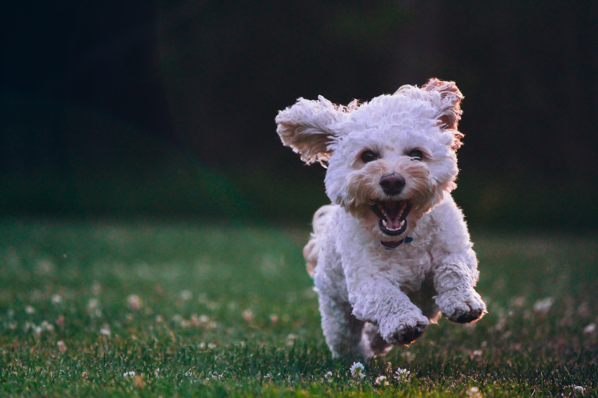
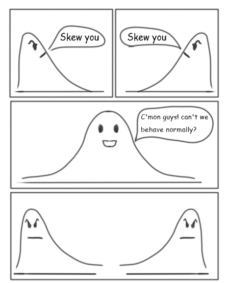

```{r setup, include=FALSE}
knitr::opts_chunk$set(echo = FALSE, message = FALSE, dpi = 300, fig.width = 7, fig.height = 5, out.height = "500px", fig.align = "center")
knitr::opts_knit$set(root.dir = here::here())
options(htmltools.dir.version = FALSE)
library(tidyverse)
theme_set(theme_minimal(base_size = 16))
options(ggplot2.discrete.colour = RColorBrewer::brewer.pal(5, "Dark2"))
library(xaringanExtra)
use_xaringan_extra(c("panelset", "tachyons"))
library(ggeffects)
options(show.signif.stars = FALSE)
library(lme4)
library(broom.mixed)
```

```{r read-data}
polite <- read_csv("01-linear-models/polite.csv") %>%
  mutate(
    attitude = factor(attitude, levels = c("inf", "pol")),
    musicstudent = factor(musicstudent, levels = c("no", "yes"))
  )
```


class: center middle


???

Photo by <a href="https://unsplash.com/@charlesdeluvio?utm_source=unsplash&utm_medium=referral&utm_content=creditCopyText">charlesdeluvio</a> on <a href="https://unsplash.com/s/photos/sad-puppy?utm_source=unsplash&utm_medium=referral&utm_content=creditCopyText">Unsplash</a>
  
---

class: center middle



???

Photo by <a href="https://unsplash.com/@joeyc?utm_source=unsplash&utm_medium=referral&utm_content=creditCopyText">Joe Caione</a> on <a href="https://unsplash.com/s/photos/happy-puppy?utm_source=unsplash&utm_medium=referral&utm_content=creditCopyText">Unsplash</a>

---

# Exercise 1: Articulation rate and politeness

- Data from Winter and Grawunder 2012.

- 16 speakers of Korean recorded in Germany.

- Informal vs polite (formal) speech.

- 6 of those speakers were music students.


???

Bodo Winter, Sven Grawunder. 2012. The phonetic profile of Korean formal and informal speech registers, Journal of Phonetics 40(6). 808-815. https://doi.org/10.1016/j.wocn.2012.08.006

---

# Exercise 1: Articulation rate and politeness

```{r art-rate, echo=TRUE}
art_lm_1 <- lmer(
  articulation_rate ~
    attitude *
    musicstudent +
    (attitude|subject),
  data = polite
)

tidy(art_lm_1, effects = "fixed")
```

---

# Exercise 1: Articulation rate and politeness

```{r art-rate-plot}
ggpredict(art_lm_1, terms = c("attitude", "musicstudent")) %>%
  plot() +
  theme(text = element_text(size = 20))
```

---

# Exercise 2: Mean f0 and politeness

```{r f0, echo=TRUE}
f0_lm_1 <- lmer(
  f0mn ~
    attitude *
    years_in_ger +
    # random slope by attitude leads to singular fit...
    (1|subject),
  data = polite
)

tidy(f0_lm_1, effects = "fixed")
```

---

# Exercise 2: Mean f0 and politeness

```{r f0-plot}
ggpredict(f0_lm_1, terms = c("attitude", "years_in_ger [1,3,6,9]")) %>%
  plot() +
  theme(text = element_text(size = 20))
```

---

class: center middle reverse

# Articulation rate and mean f0 are .green[continuous] (numeric) outcome variables...

---

class: center middle reverse

# But binary outcomes, like yes/no, correct/incorrect, true/false are not continuous!

---

class: center middle

.f1.link.dim.br3.ph3.dib.white.bg-purple[
[.white[Probability distributions]](https://seeing-theory.brown.edu/probability-distributions/index.html#section2)
]

---

# Binary outcome: Bernoulli distribution

.center[
<a title="Niklaus Bernoulli (1662-1716), Public domain, via Wikimedia Commons" href="https://commons.wikimedia.org/wiki/File:Jakob_Bernoulli.jpg"></a>
]

---

# Binary outcome: Bernoulli distribution

```{r shallow-lm-1}

```

---

# Do you notice something weird?

```{r shallow-lm-1-2}

```

---

# Log-odds

```{r log-exp, echo=TRUE}
# What is the log of 1?
log(1)

# What is the exponential function at 0?
exp(0)
```

--

<br>

Now try different numbers with `log()` and `exp()`.

---

# From log-odds to odds

```{r log-odds}
tibble(
  log_odds = seq(-2, 2, by = 0.001),
  odds = exp(log_odds)
) %>%
  ggplot(aes(log_odds, odds)) +
  geom_vline(xintercept = 0, alpha = 0.5) +
  geom_hline(yintercept = 1, linetype = "dashed") +
  geom_hline(yintercept = 0, size = 1, colour = "#8856a7") +
  geom_line(size = 2) +
  geom_point(x = 0, y = 1, size = 4) +
  scale_y_continuous(breaks = seq(0, 6, by = 1), minor_breaks = NULL) +
  labs(
    title = "Correspondence between log-odds and odds",
    subtitle = "odds = exp(log-odds)",
    x = "log-odds",
    y = "odds"
  )
```

---

# From log-odds to odds: Examples

- 10 mo infants perform on average 10 iconic gestures per day. At 11 mo, the number of gestures increases by a factor of 1.6. At 12 mo, there is a further increase by a factor of 1.2.

--

  - Calculate the average number of gestures per day at 12 months based on the 10 month average (10 gestures).

--

- The average number of errors L2 learners make decreases by a factor of 0.2 every year and a half.

--

  - Calculate the average number of errors after 6 years, assuming 265 errors at year 1.

---

# From log-odds to probabilities

```{r plogis}
# What is the exponential function at 0 log-odds?
# In other words, what are the odds at 0 log-odds?
exp(0)

# What is the probability at 0 log-odds?
plogis(0)

# What is the probability at 1 log-odds?
plogis(1)
```

--

<br>

Now try different numbers with `plogis()`.

---

# From log-odds to probabilities

```{r p-log-odds}
dots <- tibble(
  p = seq(0.1, 0.9, by = 0.1),
  log_odds = qlogis(p)
)

tibble(
  p = seq(0, 1, by = 0.001),
  log_odds = qlogis(p)
) %>%
  ggplot(aes(log_odds, p)) +
  geom_hline(yintercept = 0.5, linetype = "dashed") +
  geom_hline(yintercept = 0, colour = "#8856a7", size = 1) +
  geom_hline(yintercept = 1, colour = "#8856a7", size = 1) +
  geom_vline(xintercept = 0, alpha = 0.5) +
  geom_line(size = 2) +
  geom_point(data = dots, size = 4) +
  scale_x_continuous(breaks = seq(-6, 6, by = 2), minor_breaks = NULL) +
  scale_y_continuous(breaks = seq(0, 1, by = 0.1), minor_breaks = NULL) +
  labs(
    title = "Correspondence between log-odds and probabilities",
    x = "log-odds",
    y = "probability"
  )
```

---

# Binary outcome: Bernoulli distribution

```{r shallow-lm-1-3}

```

---

# Binary outcome: Bernoulli distribution

```{r shallow-lm-1-plot}

```


---

# Binary outcome: Bernoulli distribution

```{r shallow-lm-2}

```


---

# Binary outcome: Bernoulli distribution

```{r shallow-lm-2-plot}

```


---

# BTW, the normal distribution ain't that normal

.center[

