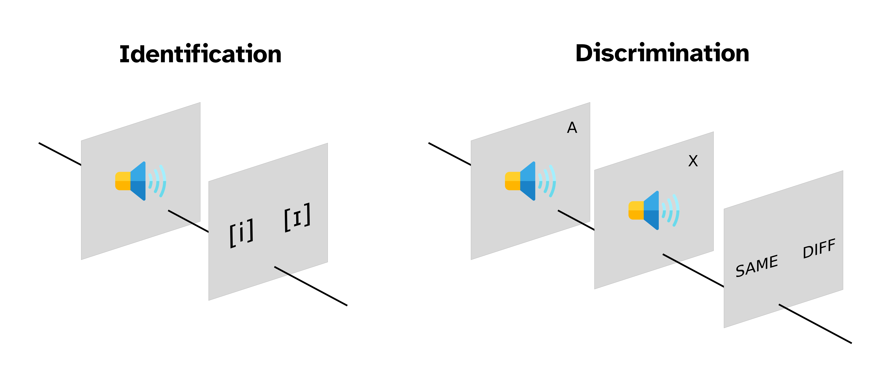

```{r setup, include=FALSE}
knitr::opts_chunk$set(echo = FALSE, message = FALSE, dpi = 300, fig.width = 7, fig.height = 5, out.height = "500px", fig.align = "center")
knitr::opts_knit$set(root.dir = here::here())
options(htmltools.dir.version = FALSE)
library(tidyverse)
theme_set(theme_minimal(base_size = 16))
options(ggplot2.discrete.colour = RColorBrewer::brewer.pal(5, "Dark2"))
library(xaringanExtra)
use_xaringan_extra(c("panelset", "tachyons"))
library(ggeffects)
options(show.signif.stars = FALSE)
library(lme4)
library(broom.mixed)
```

```{r read-data}
sanker2020 <- read_csv("02-ident-discr/sanker2020.csv") %>%
  mutate(OrigCoda = factor(OrigCoda, levels = c("voiceless", "voiced")))


# Read SPP 2022 students' data
spp2022 <- read_delim("02-ident-discr/anonymous-session1.txt")

spp2022_ident <- spp2022 %>% filter(task == "identification") %>%
  mutate(
    step = as.numeric(str_sub(stimulus, 5, 5)),
    response = factor(response, levels = c("i", "_"))
  )

spp2022_discr <- spp2022 %>% filter(task == "discrimination") %>%
  mutate(
    pair = case_when(
      stepA == stepB ~ 0,
      stepA == "step1" & stepB == "step3" ~ 2,
      stepA == "step3" & stepB == "step1" ~ 2,
      stepA == "step3" & stepB == "step5" ~ 4,
      stepA == "step5" & stepB == "step3" ~ 4,
      stepA == "step5" & stepB == "step7" ~ 6,
      stepA == "step7" & stepB == "step7" ~ 6
    ),
    correct = factor(wasResponsecorrect)
  ) %>%
  filter(pair > 0)
```

# Analysis of identification and discrimination data



???

Identification tasks are also called 2AFC tasks (two-alternative forced-choice task).

Discrimination tasks are also called AX tasks.

---

# Identification: Vowel duration

- Data from Sanker 2020.

- Participants listen to words and have to say if the vowel is short (0) or long (1).

- Vowel duration was manipulated in 10 steps of about 15 ms each.

- Furthermore, vowel splices come either from words with a final voiceless stop or from words with a final voiced stop.


???

Sanker, C. (2020). A perceptual pathway for voicing-conditioned vowel duration. Laboratory Phonology, 11(1).

---

# Identification: Vowel duration

```{r sanker-lm-1, echo=TRUE}
sanker_lm_1 <- glmer(
  Longresps ~
    durationstep +
    (durationstep | participant),
  data = sanker2020,
  family = binomial
)

tidy(sanker_lm_1, effects = "fixed")
```

???

In the table with the model estimates, `statistic` is the *z*-statistic.

---

# From log-odds to probabilities

```{r p-log-odds}
dots <- tibble(
  p = seq(0.1, 0.9, by = 0.1),
  log_odds = qlogis(p)
)

tibble(
  p = seq(0, 1, by = 0.001),
  log_odds = qlogis(p)
) %>%
  ggplot(aes(log_odds, p)) +
  geom_hline(yintercept = 0.5, linetype = "dashed") +
  geom_hline(yintercept = 0, colour = "#8856a7", size = 1) +
  geom_hline(yintercept = 1, colour = "#8856a7", size = 1) +
  geom_vline(xintercept = 0, alpha = 0.5) +
  geom_line(size = 2) +
  geom_point(data = dots, size = 4) +
  scale_x_continuous(breaks = seq(-6, 6, by = 2), minor_breaks = NULL) +
  scale_y_continuous(breaks = seq(0, 1, by = 0.1), minor_breaks = NULL) +
  labs(
    title = "Correspondence between log-odds and probabilities",
    x = "log-odds",
    y = "probability"
  )
```

---

# Identification: Vowel duration

```{r sanker-lm-1-plot, message=FALSE, warning=FALSE}
ggpredict(sanker_lm_1, terms = "durationstep") %>%
  # Set y limits to 0-1 = 0-100% probability
  plot(limits = c(0, 1)) +
  # Add horizontal lines at 0% and 100% probability
  geom_hline(yintercept = 0) +
  geom_hline(yintercept = 1) +
  # Add dotted horizontal line at 50% probability
  geom_hline(yintercept = 0.5, linetype = "dotted") +
  # Set breaks for x-axis (durationstep)
  scale_x_continuous(breaks = seq(1, 10))
```

---

# Identification: Category boundary

<br>
<br>
<br>
<br>


.f1[
$$
CB = -\frac{Intercept}{Slope}
$$
]

---

# Identification: Category boundary

```{r sanker-lm-1-2, echo=TRUE}
sanker_lm_1 <- glmer(
  Longresps ~
    durationstep +
    (durationstep | participant),
  data = sanker2020,
  family = binomial
)

tidy(sanker_lm_1, effects = "fixed")
```

---

# Identification: Category boundary

<br>
<br>
<br>
<br>


.f1[
$$CB = -\frac{Intercept}{Slope}$$

$$= -\frac{-3.01}{0.538} = 5.6$$
]

---

# Identification: Category boundary

```{r sanker-lm-1-plot-2, message=FALSE, warning=FALSE}
ggpredict(sanker_lm_1, terms = "durationstep") %>%
  # Set y limits to 0-1 = 0-100% probability
  plot(limits = c(0, 1)) +
  # Add horizontal lines at 0% and 100% probability
  geom_hline(yintercept = 0) +
  geom_hline(yintercept = 1) +
  # Add dotted horizontal line at 50% probability
  geom_hline(yintercept = 0.5, linetype = "dotted") +
  # Set breaks for x-axis (durationstep)
  scale_x_continuous(breaks = seq(1, 10)) +
  # Add category boundary
  geom_vline(xintercept = 5.6, colour = "green", linetype = "dashed", size = 1)
```

---

# Identification: Boundary crispness/fuzziness

Use Contrast Coefficient Slope (CCS).

<br>
<br>
<br>
<br>


.f1[
$$CCS = Slope \times 0.25$$
]

--

.f1[
$$= 0.538 \times 0.25 = 0.1345$$
]


---

# Identification: Boundary crispness/fuzziness

```{r sanker-lm-1-plot-3, message=FALSE, warning=FALSE}
ggpredict(sanker_lm_1, terms = "durationstep") %>%
  # Set y limits to 0-1 = 0-100% probability
  plot(limits = c(0, 1)) +
  # Add horizontal lines at 0% and 100% probability
  geom_hline(yintercept = 0) +
  geom_hline(yintercept = 1) +
  # Add dotted horizontal line at 50% probability
  geom_hline(yintercept = 0.5, linetype = "dotted") +
  # Set breaks for x-axis (durationstep)
  scale_x_continuous(breaks = seq(1, 10)) +
  # Add category boundary
  geom_vline(xintercept = 5.6, colour = "green", linetype = "dashed", size = 1) +
  # Add CCS
  geom_abline(intercept = 0.5 - 0.1345 * 5.6, slope = 0.1345, colour = "orange", size = 1)
```


---

class: center middle reverse

# EXERCISE 1

---

# Discrimination: Vowel quality

- Your data!

- Discriminate between stimuli along a [i] ~ [ɪ] continuum.

- Two conditions:
  
  - **Same**: step1-1, step3-3, step5-5, step7-7.
  
  - **Different**: step1-3, step3-5, step5-7 (and reverse).
  
- For the "different condition", the `pair` column:

  - step1-3 = 2, step3-5 = 4, step5-7 = 6.

---

# Discrimination: Vowel quality

```{r spp2022-lm-discr, echo=TRUE}
spp2022_lm_discr <- glmer(
  correct ~
    pair + I(pair^2) + (pair | participant),
  data = spp2022_discr,
  family = binomial
)

tidy(spp2022_lm_discr, effects = "fixed")
```

---

# Discrimination: Vowel quality

```{r spp2022-lm-discr-plot, message=FALSE, warning=FALSE}
ggpredict(spp2022_lm_discr, terms = "pair") %>%
  # Set y limits to 0-1 = 0-100% probability
  plot(limits = c(0, 1)) +
  # Add horizontal lines at 0% and 100% probability
  geom_hline(yintercept = 0) +
  geom_hline(yintercept = 1) +
  # Add dotted horizontal line at 50% probability
  geom_hline(yintercept = 0.5, linetype = "dotted") +
    # Set breaks for x-axis (pair)
  scale_x_continuous(breaks = c(2, 4, 6))
```


---

class: center middle reverse

# EXERCISE 2
